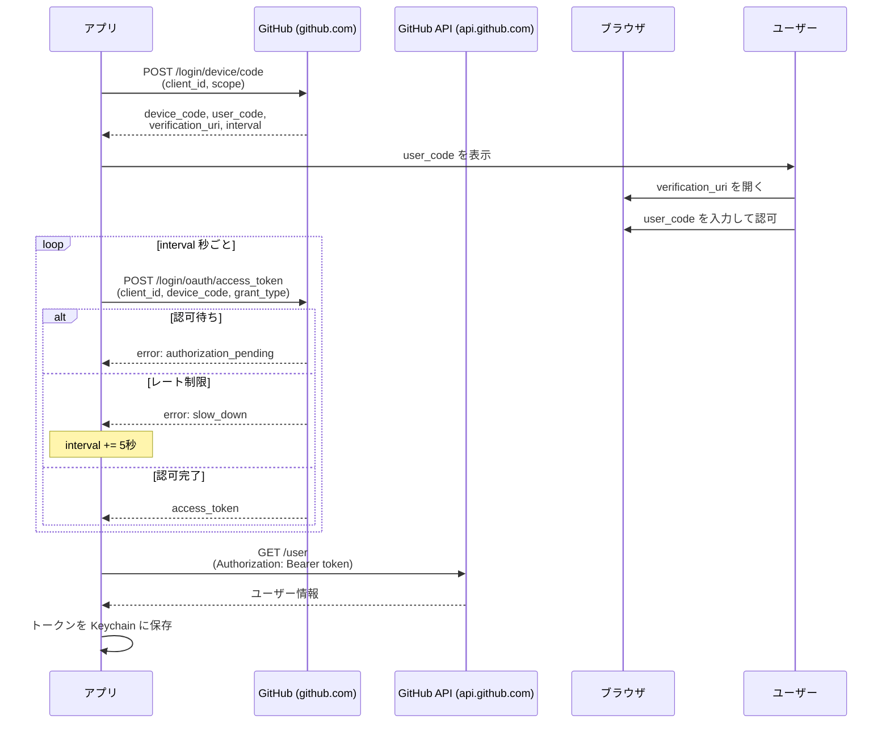
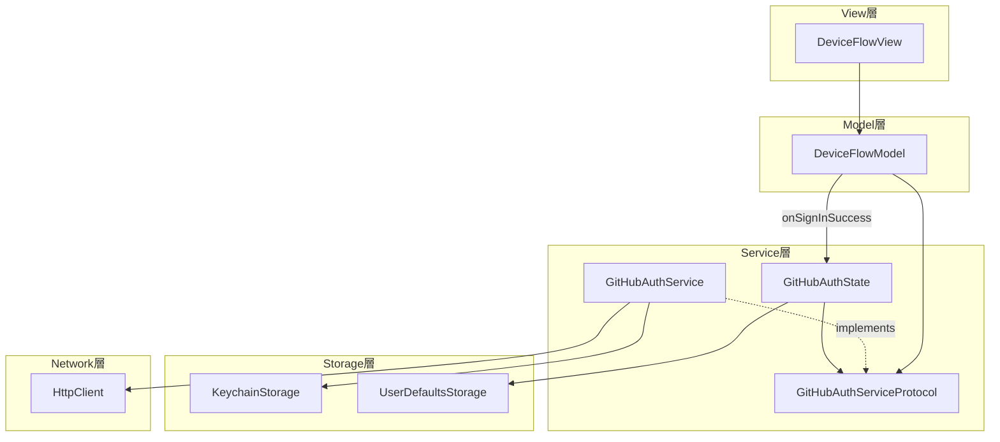
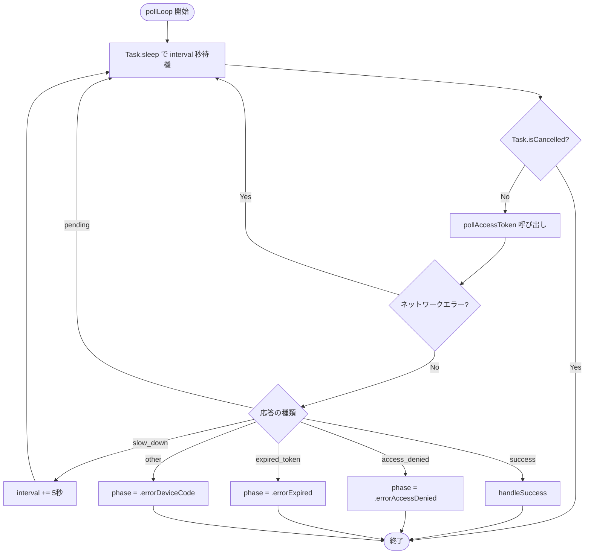
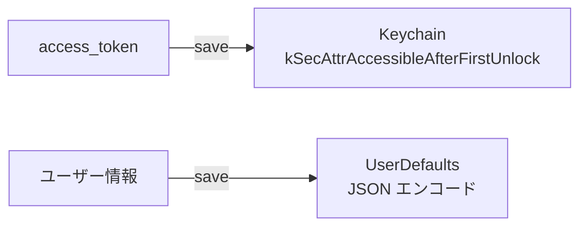

# GitHub OAuth Device Flow 技術ドキュメント

## Device Flow とは

ブラウザでの OAuth 認可画面が使えないデバイス（CLI、TV、モバイルアプリ等）向けの OAuth 2.0 認可フロー。ユーザーはアプリに表示されたコードを別のブラウザで入力し、認可を完了する。

RFC 8628 (OAuth 2.0 Device Authorization Grant) に基づく。

## フロー全体像



## 実装の構造



## 各層の責務

### DeviceFlowView

UI の描画と操作の受付。`model.phase` を `switch` して画面を切り替える。

| Phase | 表示 |
|---|---|
| `.loadingDeviceCode` | プログレスインジケータ |
| `.polling(code)` | ユーザーコード + 「ブラウザで開く」ボタン |
| `.errorDeviceCode(.network)` | エラー + 再試行ボタン |
| `.errorDeviceCode(.config)` | 設定エラー（Client ID 不在） |
| `.errorAccessDenied` | ユーザーが認可を拒否 |
| `.errorExpired` | コード有効期限切れ + 再開ボタン |

ファイル: `Features/Auth/DeviceFlowView.swift`

### DeviceFlowModel

Device Flow のビジネスロジック。`@Observable` クラス。

主要メソッド:

- **`start()`** — フローを開始。`Task` を生成して `runDeviceFlow()` を実行
- **`runDeviceFlow()`** — Device Code を取得し、`pollLoop()` に入る
- **`pollLoop()`** — トークン取得まで `interval` 秒ごとにポーリング
- **`handleSuccess()`** — トークン取得後、ユーザー情報を取得してコールバック

ファイル: `Features/Auth/DeviceFlowModel.swift`

### GitHubAuthService

GitHub OAuth API との通信を担う。`HttpClient` を使って HTTP リクエストを送る。

| メソッド | API エンドポイント | 処理 |
|---|---|---|
| `requestDeviceCode()` | `POST /login/device/code` | Device Code を取得 |
| `pollAccessToken()` | `POST /login/oauth/access_token` | アクセストークンをポーリング |
| `fetchAuthenticatedUser()` | `GET /user` | 認証済みユーザー情報を取得 |
| `saveToken()` / `loadToken()` / `clearToken()` | — | Keychain 経由のトークン管理 |

ファイル: `Common/Auth/GitHubAuthService.swift`

### GitHubAuthState

アプリ全体の認証状態を管理する `@Observable` クラス。

```
signedOut ──beginSigningIn()──▶ signingIn ──completeSignIn()──▶ signedIn
    ▲                              │                              │
    │            cancelSigningIn() │              logout() / 401  │
    └──────────────────────────────┘◀─────────────────────────────┘
```

- `completeSignIn()` — トークンを Keychain に保存し、プロファイルを UserDefaults にキャッシュ
- `handle401()` — API が 401 を返したとき、セッションをクリアして `signedOut` に戻す
- 起動時に Keychain にトークンがあれば `signedIn` で初期化（プロファイルは UserDefaults キャッシュから復元）

ファイル: `Common/Auth/GitHubAuthState.swift`

## ポーリングの実装

`DeviceFlowModel.pollLoop()` がポーリングの中心。



設計上のポイント:

- **動的間隔調整**: `slow_down` を受けたら `interval` を 5 秒加算（RFC 8628 §3.5 準拠）
- **ネットワーク障害への耐性**: ポーリング中の通信エラーは `continue` で無視し、次のサイクルで再試行
- **協調的キャンセル**: `Task.isCancelled` と `CancellationError` の両方をチェック。View の `onDisappear` で `model.cancel()` が呼ばれる
- **テスト用 `intervalScale`**: `init` で渡す係数。テスト時は `0.0` にして待機をスキップ

## トークンの保存



- **トークン**: `KeychainStorage` で iOS Keychain に保存。`kSecAttrAccessibleAfterFirstUnlock` で保護（デバイスの初回ロック解除後にアクセス可能）
- **プロファイル**: `UserDefaultsStorage<GitHubAuthenticatedUser>` で UserDefaults にキャッシュ。起動時にトークンがあればキャッシュからプロファイルを即座に復元し、API 応答を待たずに UI を表示できる

## エラーハンドリング

### Device Code 取得フェーズ

| エラー | 原因 | Phase | ユーザーへの対応 |
|---|---|---|---|
| `GitHubAuthConfigError.missingClientID` | Client ID 未設定 | `.errorDeviceCode(.config)` | 設定確認を促す |
| その他のエラー | ネットワーク障害等 | `.errorDeviceCode(.network)` | 再試行ボタン |
| `CancellationError` | ユーザーが画面を離れた | — | 何もしない |

### ポーリングフェーズ

| GitHub の応答 | 意味 | 処理 |
|---|---|---|
| `authorization_pending` | ユーザーがまだ認可していない | ポーリング継続 |
| `slow_down` | リクエスト頻度が高い | interval += 5 して継続 |
| `access_denied` | ユーザーが認可を拒否 | エラー表示（閉じるのみ） |
| `expired_token` | コードの有効期限切れ | エラー表示（再開ボタンあり） |
| ネットワークエラー | 通信障害 / サーバー障害 | 無視してポーリング継続 |

### 認証後

`AuthenticatedHttpClient` が全 API リクエストに Bearer トークンを付与し、401 応答を受けたら `GitHubAuthState.handle401()` でセッションをクリアする。

## DTO → ドメインモデル変換

GitHub API のレスポンス JSON は DTO (Data Transfer Object) としてデコードし、`toDomain()` でドメインモデルに変換する。

```
JSON → GitHubDeviceCodeDTO → GitHubDeviceCode
JSON → GitHubAuthTokenResponseDTO → GitHubAuthTokenOutcome
JSON → GitHubAuthenticatedUserDTO → GitHubAuthenticatedUser
```

`GitHubAuthTokenResponseDTO` は `init(from:)` で手動デコードし、`error` フィールドの値に応じて `GitHubAuthTokenOutcome` の各ケースに振り分ける。

## テスト

`MockGitHubAuthService` が `GitHubAuthServiceProtocol` に適合し、テスト時に使われる。

- `intervalScale: 0.0` でポーリング待機をスキップ
- `setPollHandler()` でポーリング応答をテストケースごとに動的に制御
- `pollCallCount` / `savedTokenHistory` 等の観測プロパティで呼び出しを検証
- `OSAllocatedUnfairLock` でスレッドセーフな状態管理（並列テスト対応）
